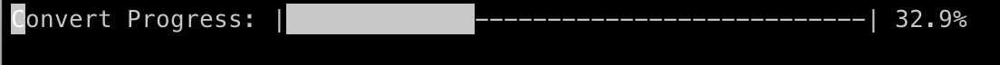

# Open Img Dataset to Haar Cascades
## Convert the Open Images Dataset to a Haar Cascades Dataset for OpenCV.

## 1. Get this Repository
```bash
git clone https://github.com/Celpear/Open-Img-Dataset-to-Haar-Cascades.git
cd Open-Img-Dataset-to-Haar-Cascades
```
## 2. Install Dependencies
```bash
pip install -r requirements.txt
```

## 3. Obtain the Open Images Dataset downloader
```bash
git clone https://github.com/EscVM/OIDv4_ToolKit.git
```
## 4. Download the dataset you want
For example, to download images of a Banjo:
```bash
cd OIDv4_ToolKit
pip install -r requirements.txt
python3 main.py downloader --classes Banjo --type_csv all --limit 10 --multiclasses 1 --y
cd ../
```

## 5. Start the conversion process for the Banjo Demo
Make sure you are in the main directory and not within the OIDv4_ToolKit directory.
```bash
python3 oid2hc.py --output_dir haar_cascade_dataset --data_dir OIDv4_ToolKit/OID/Dataset/train/Banjo
```
Or if you want to see all images and boxes for debugging:
```bash
python3 oid2hc.py --output_dir haar_cascade_dataset --data_dir OIDv4_ToolKit/OID/Dataset/train/Banjo --show_images True
```
## 6. That's it

You will find the images in the haar_cascade_dataset directory.

## Would you like to generate annotations for TensorFlow Light model training as well? If so, you can utilize the following command:
```bash
python3 hc2tfLite.py --pos_file_path haar_cascade_dataset/pos.txt --object_name Banjo
```
This command generates annotations, with haar_cascade_dataset/pos.txt being the path to the positive file and Banjo as the object name for which you want to create annotations.


